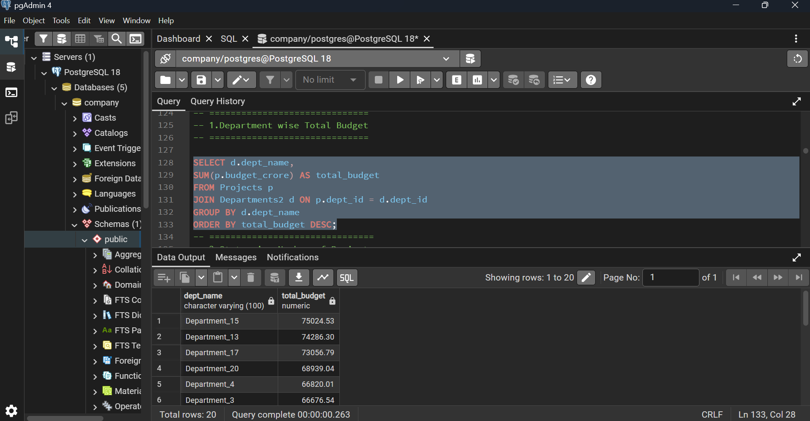
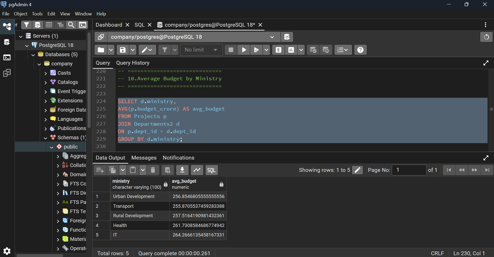
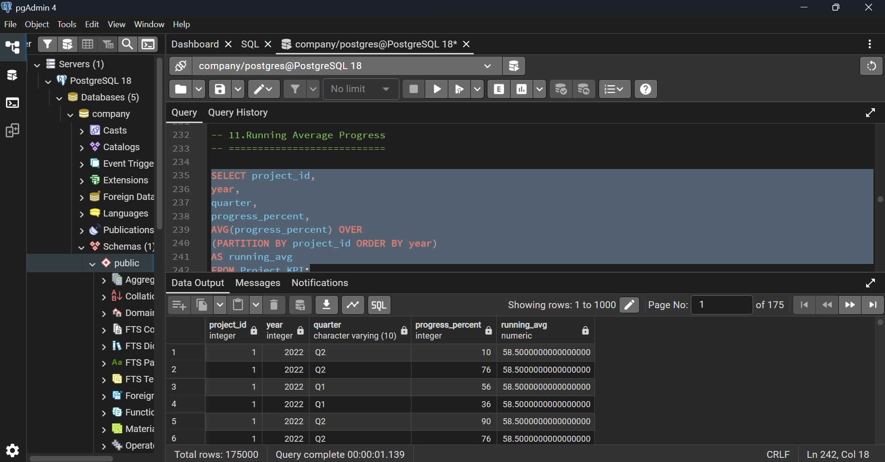

# 🚀 Government Digital Transformation SQL Project

## 📌 Overview
This project focuses on analyzing government digital transformation initiatives using SQL and Power BI.

It includes data modeling, SQL analysis, and interactive dashboard creation to generate real-world insights.

---

## 🗂 Database Structure

- Departments  
- Projects  
- Contractors  
- Project Assignments  
- KPI Tracking  

---

## ⚙️ Tools Used

- SQL  
- Power BI  
- Data Modeling  
- Analytical Queries  

---

## 📊 Key Analysis

- Department-wise budget allocation  
- State-wise project distribution  
- Top 5 highest budget projects  
- Contractor performance analysis  
- Citizen satisfaction trends  
- Budget utilization tracking  
- Project delay analysis  

---

## 📊 Dashboard Preview

### Overview

### Department Analysis

### Contractor Analysis

---

## 📁 Files Included

- govt_digital_transformation.sql → Full SQL project  
- govt_digital_transformation.pbix → Power BI dashboard  
- govt_digital_transformation.pdf → Dashboard preview  

---

## 🔍 Key Insights

- Identified delayed projects (progress < 50%)  
- Found top-performing departments  
- Analyzed budget vs satisfaction relationship  
- Evaluated contractor performance  

---

## 👨‍💻 Author

Annu
Aspiring Data Analyst, Business Analyst 

---

## 🔗 Connect

Open to Data Analyst opportunities 🚀
